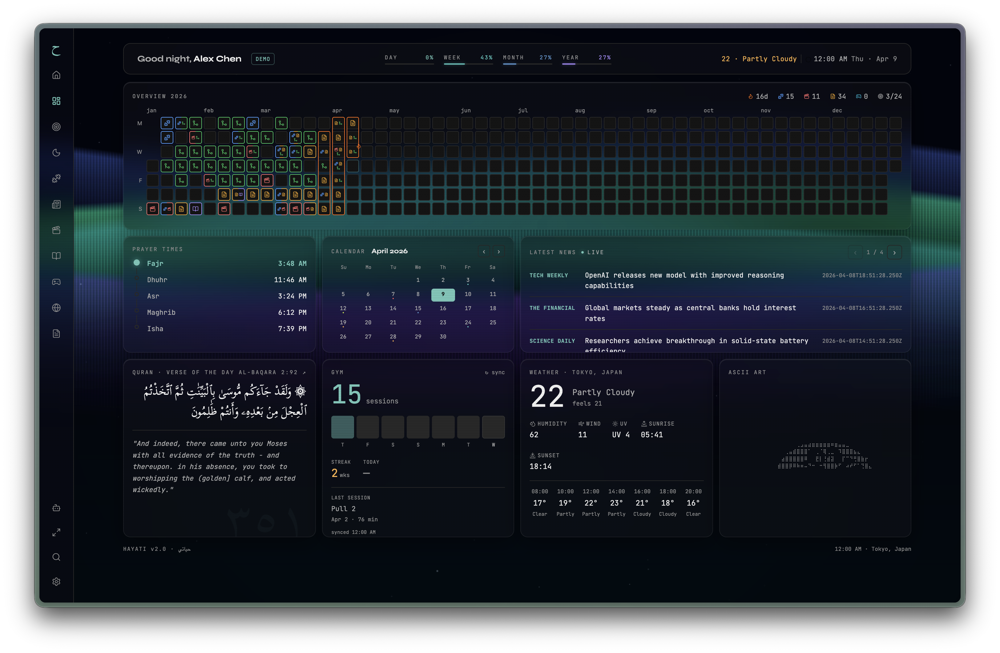
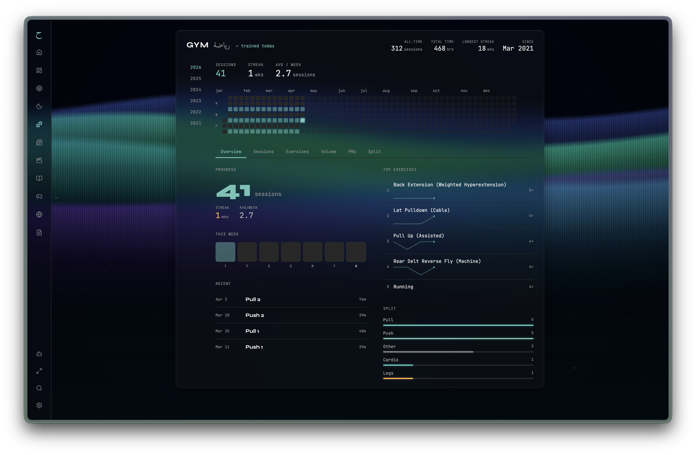

# hayati — حياتي

> A personal life dashboard. _Hayati_ means "my life" in Arabic.

A self-hosted, local-first dashboard that aggregates the things you track every day — workouts, films, books, games, notes, prayer times, news, and travel — into one place. No cloud account required. Your data stays on your machine.

   

---

## What it looks like





---

## Pages

### Dashboard

Drag-and-drop widget grid powered by `react-grid-layout`. Widgets include live weather, a world clock, GitHub contribution heatmap, prayer times countdown, Pomodoro timer, Quran verse of the day, gym stats, news headlines, and an on-device AI chat panel via Ollama.

### Overview

Annual activity summary — stacked heatmaps for gym sessions, Obsidian notes, films watched, and GitHub commits, all on the same time axis. Includes goals tracker, latest books and games, and note recency breakdown by folder.

### Gym

Deep workout analytics pulled from the Hevy API — weekly volume trends, personal records per exercise, session streaks, split breakdowns, and a full year heatmap. Supports filtering by year.

### Films

Letterboxd diary parsed from the RSS feed — poster grid, timeline view, star ratings, rewatch and liked filters, and full-text search. Posters are fetched and cached automatically.

### Reading

Book log with cover art fetched from Open Library. Tracks title, author, and finish date. Grid and list views.

### Gaming

Game log with cover art fetched from SteamGridDB. Tracks platform, rating, and finish date. Grid and list views.

### Notes

Full Obsidian vault browser. Renders the file tree, a D3 force-directed graph of wiki-links between notes, backlinks panel, and a markdown editor with syntax highlighting and auto-save. Renames propagate to disk.

### Prayer

Prayer times calculated entirely offline using the Adhan.js library — no API call needed. Shows all five daily prayers with a live countdown to the next one. Supports multiple calculation methods (MWL, Dubai, Egyptian, North America, etc.) and adjusts to your configured location.

### Travel

Interactive world map (11 D3 projections available) and a 3D globe view. Click any country to mark it as visited. Visited countries sync to local storage.

### News

RSS reader with configurable feeds. Full article text is extracted server-side using `@extractus/article-extractor` and rendered in a clean reading view.

---

## Technical highlights

**Canvas-based animated backgrounds**  
Nine background themes — Mesh orbs, Aurora, Starfield, Night city, Rain streaks, Matrix rain, Fireflies, Particle network, and Gradient — each implemented as a `requestAnimationFrame` canvas loop in its own component. Zero dependencies, runs at 60fps.

**Offline prayer times**  
Prayer times are computed entirely on the client using the Adhan library. No external API, no rate limits, works without internet.

**Obsidian graph view**  
A D3 force simulation builds a node-link graph of wiki-links across your vault in real time. Nodes size by link count; clicking a node opens the note.

**Demo mode**  
A single toggle in Settings replaces every piece of personal data — name, location, workouts, films, books, games, notes, GitHub activity, news, weather — with a consistent fictional persona. Implemented by intercepting `useGlobalSettings()` and all data hooks, so no page needs to know it exists.

**Local-first persistence**  
Settings and data are written to `localStorage` and mirrored to a local SQLite database via a small `/api/store` route using `better-sqlite3`. Nothing leaves your machine unless you configure an external integration.

**Type-safe API layer**  
All external integrations (Hevy, Letterboxd, GitHub, weather, SteamGridDB, calendar, news) are server-side Next.js route handlers. The browser never touches third-party APIs directly, and API keys never reach the client.

---

## Integrations

| Service                                    | What it powers                     | Auth                                    |
| ------------------------------------------ | ---------------------------------- | --------------------------------------- |
| [Hevy](https://hevy.com)                   | Workout history and analytics      | API key (`.env.local`)                  |
| [Letterboxd](https://letterboxd.com)       | Film diary                         | Public RSS — just your username         |
| [GitHub](https://github.com)               | Contribution heatmap               | Personal access token (in-app settings) |
| [SteamGridDB](https://www.steamgriddb.com) | Game cover art                     | API key (`.env.local`)                  |
| [Open Library](https://openlibrary.org)    | Book cover art                     | None — public CDN                       |
| [Ollama](https://ollama.com)               | On-device AI chat                  | Local — no key needed                   |
| [Obsidian](https://obsidian.md)            | Notes vault browser and graph view | Local vault path (in-app settings)      |
| Open-Meteo                                 | Weather                            | None — free, no key                     |
| iCal feeds                                 | Calendar events                    | Feed URL (in-app settings)              |
| RSS feeds                                  | News                               | Feed URL (in-app settings)              |

---

## Setup

### 1. Install dependencies

```bash
pnpm install
```

### 2. Configure environment variables

```bash
cp .env.example .env.local
```

Open `.env.local` and fill in any keys for services you want to use. Everything except Hevy and SteamGridDB works without any keys.

### 3. Run

```bash
pnpm dev
```

Open [http://localhost:3000](http://localhost:3000) and configure your name, location, and integrations in **Settings**.

---

## Tech stack

|              |                                                            |
| ------------ | ---------------------------------------------------------- |
| Framework    | Next.js 16 — App Router, server components, API routes     |
| Language     | TypeScript 5                                               |
| Storage      | `localStorage` + SQLite via `better-sqlite3`               |
| Maps         | D3 geo projections, TopoJSON world atlas, `react-globe.gl` |
| Graph        | D3 force simulation (notes graph view)                     |
| Prayer times | Adhan.js — fully offline calculation                       |
| Fonts        | JetBrains Mono, Syne                                       |
| Icons        | Lucide React                                               |

---

## Demo mode

Toggle **Demo mode** in Settings → General to replace all personal data with a fictional persona — useful for recording clips or sharing screenshots without exposing real information.
